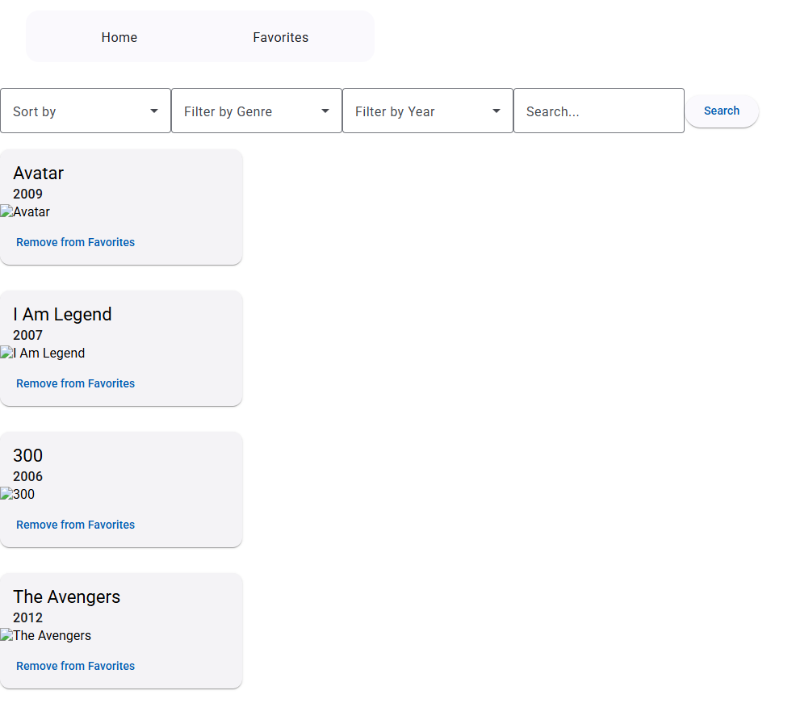

1. **<a href="?tab=readme-ov-file#prerequisites">Prerequisites</a>**
2. **<a href="?tab=readme-ov-file#setup-instructions">Setup instructions</a>**
3. **<a href="?tab=readme-ov-file#additional-notes">Additional notes</a>**

# Prerequisites:

1. NodeJS 22.14.0
2. Angular 19
3. .NET 8

- In case of .NET import issues, the list of used packages for the backend is found [here](http://github.com/guybeckenstein/movies-app/tree/main/MoviesSPA/packages).

# Setup instructions:

1. Download and install .NET 8 [from here](https://dotnet.microsoft.com/en-us/download/dotnet/8.0).
2. Download and install NVM [from here](https://github.com/coreybutler/nvm-windows#readme). Then, go to CMD or terminal and type:
   1. `nvm install 22.14.0`
   2. `nvm use 22.14.0`
3. Go to `home-assignment\MoviesSPA\Client\app` directory, type `npm i` and then `npm run start`.
4. Go to Visual Studio, build the solution and then debug `Api` project.
5. Make HTTP requests in this order, using **Postman** or **Scalar**:
   1. `api/Auth/register`
   2. `api/Auth/login`
   3. `api/Movies/`

# Additional notes:

1. `[ServiceFilter(typeof(ValidationFilterAttribute))]` filter logic is not implemented from _localhost:4200_ host request, because it breaks the code. **When running the requests from `localhost:7221` the logic is used**
2. The focus here is not on styling the webpage elements
